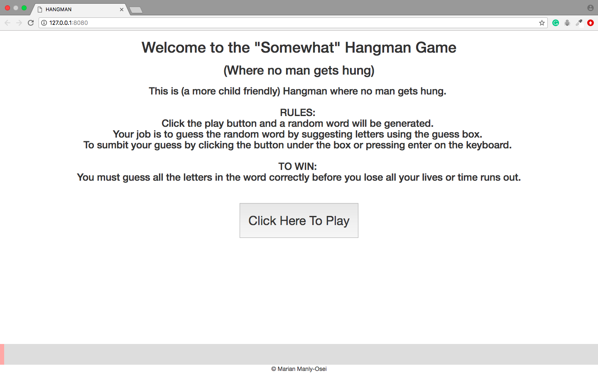
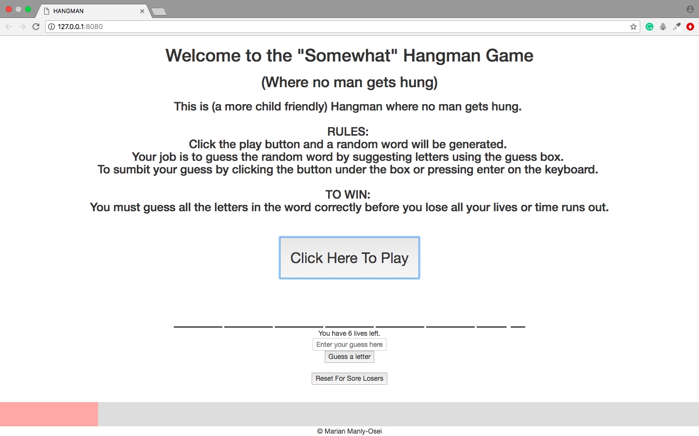
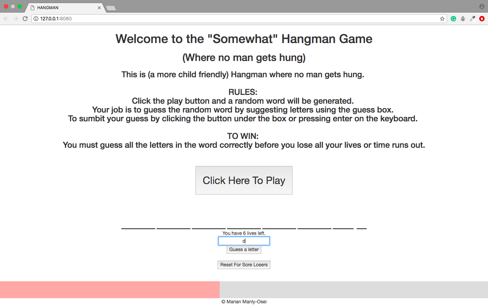
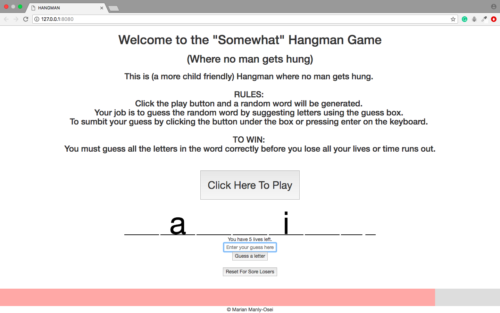
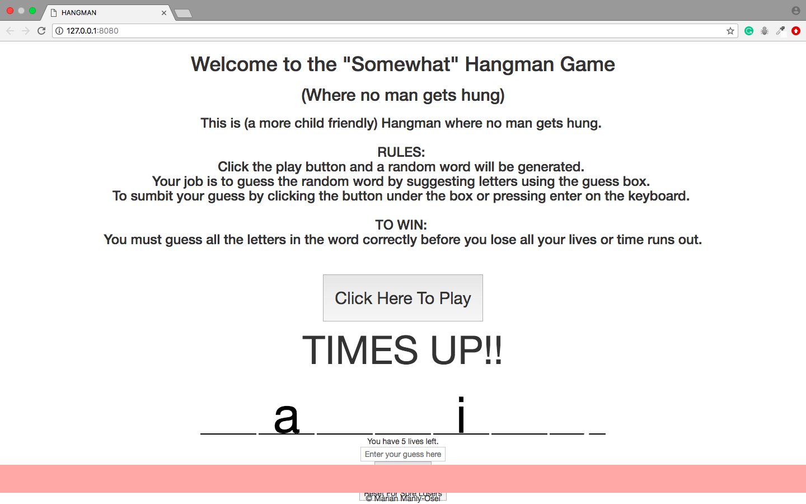

# Sparta Core Project One: Hangman

Hello and welcome to my game project!


## Description
I was tasked with creating a game using the technologies I had been taught so far. These include, but are not limited to:

* HTML
* Bootstrap
* CSS
* JavaScript
* jQuery

I chose to make Hangman. I love words and wanted to create something that I could potentially play with my younger siblings.

## Installation
You will be able download the files for this game via a zip file and cloning the Repo from Github
## Challenges
I really did find the whole project really difficult. Grasping JavaScript in the previous week was a real struggle. I seemed to understand how to construct functions, if statements and loops, however, applying them to problems was difficult. I realised, half way through the week, that I had approached the game in the wrong way.

I started off with creating wire frames and then trying to set up my HTML before attaching my JavaScript logic to it. For some reason, unknown to me, I found this to be very frustrating and I couldn't make my components work.

I then had to start again from the beginning and start with with my JavaScript logic first starting with a very small step and then building in the functionality and I made the small parts work properly on their own.

I found out, doing things this way, that I hadn't broken down my user stories properly, or ordered them well, during the planning stage. This made it difficult to know know where to start, or even how to proceed.

Although I was upset at having to start again from the beggining, I am happy that I did, and with a new approach, because now I have a framework to work from for the next time that I have a project like this again.


## Code snippets

Here is an example of code that I initially found difficult to put together but now makes complete sense to me.

The code below shows you how the play button and the random word generator works. The first section holds some of the global variable that I made.

```
var words = [
    '*****',
    '*****',
    '*****',
    '*****',
  ];
  var lettersArray;
  var index = Math.floor(Math.random() * words.length);
  var id;
  var livesLeft = 6;
```
The code below shows that I stored the random word generator inside the click event for the play button and a toggle switch also turns on the display for the game area at the same time.

```
  //This generates a random word to be guessed
  $('#play').one('click', function () {
    submitGuess();
    $('.game-area').toggle(); //turns on the game area once the play button is clicked

    for (var i = 0; i < words[index].length; i++) {
      var letter = $('<div class="letter">' + words[index][i] + '</div>');
      $('#word').append(letter);
    }
    $('#current-score').html(livesLeft);
    move();
  });
```
Still within the click event, I added the ability to use the enter button to submit a guess.

```
  //This allows the Enter button on the keyboard to submit a guess
  window.addEventListener("keydown", function (event) {
    if (event.keyCode === 13) {
      submitGuess();
    }
  })
```


These are some of the things that I found challenging during the project, but now I believe I will be able to replicate this in other projects to come.

## Images and links (optional)




Game started with time bar moving

Only one letter in the input box

Correct guessed showing up the game area

Game lost because time is up
